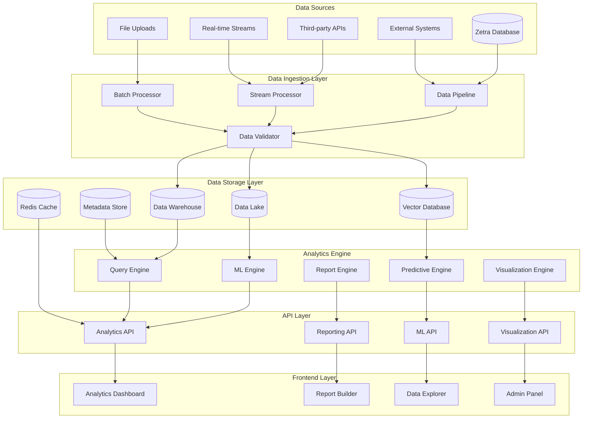
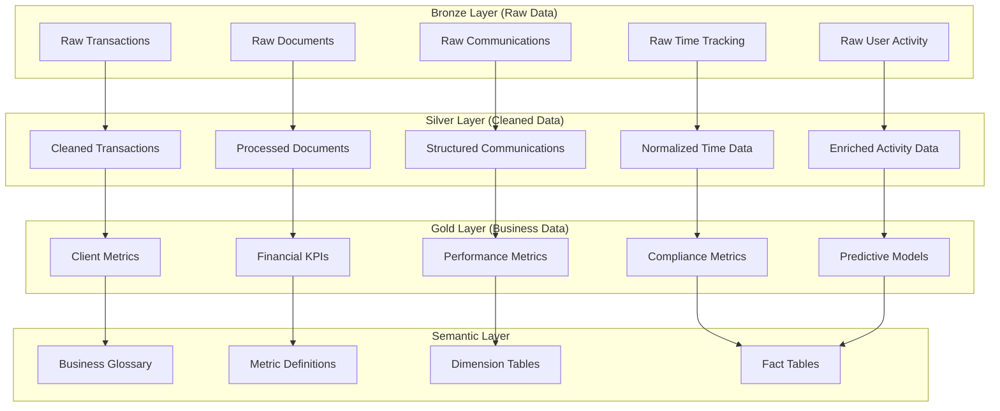

# Advanced Analytics Platform - Design Document

## Overview

The Advanced Analytics Platform transforms Zetra into a comprehensive business
intelligence and analytics powerhouse for CA firms. This design leverages modern
data architecture, machine learning, and advanced visualization technologies to
provide real-time insights, predictive analytics, and intelligent decision
support.

## Architecture

### High-Level Architecture



### Data Architecture



## Components and Interfaces

### 1. Analytics Engine Service

**Purpose:** Core analytics processing and computation engine

**Key Responsibilities:**

- Execute complex analytical queries
- Perform statistical analysis and calculations
- Manage data aggregations and transformations
- Provide real-time analytics capabilities
- Handle concurrent analytical workloads

**Interface:**

```typescript
interface AnalyticsEngine {
  executeQuery(query: AnalyticsQuery): Promise<QueryResult>
  calculateMetrics(
    metrics: MetricDefinition[],
    filters: FilterCriteria
  ): Promise<MetricResult[]>
  performAggregation(
    data: Dataset,
    aggregationType: AggregationType
  ): Promise<AggregatedData>
  generateInsights(
    data: Dataset,
    analysisType: AnalysisType
  ): Promise<Insight[]>
  createDashboard(config: DashboardConfig): Promise<Dashboard>
}

interface AnalyticsQuery {
  id: string
  type: QueryType
  dimensions: string[]
  measures: string[]
  filters: FilterCriteria
  timeRange: TimeRange
  granularity: TimeGranularity
}

interface MetricResult {
  metricId: string
  value: number
  trend: TrendDirection
  variance: number
  confidence: number
  context: MetricContext
}
```

### 2. Machine Learning Service

**Purpose:** Predictive analytics and machine learning capabilities

**Key Features:**

- Automated model training and deployment
- Real-time prediction serving
- Model performance monitoring
- Feature engineering and selection
- A/B testing for models

**Interface:**

```typescript
interface MLService {
  trainModel(config: ModelConfig, data: TrainingData): Promise<TrainedModel>
  predict(modelId: string, features: FeatureVector): Promise<Prediction>
  batchPredict(modelId: string, dataset: Dataset): Promise<BatchPrediction>
  evaluateModel(modelId: string, testData: TestData): Promise<ModelEvaluation>
  deployModel(
    modelId: string,
    deploymentConfig: DeploymentConfig
  ): Promise<DeploymentResult>
}

interface ModelConfig {
  algorithm: MLAlgorithm
  hyperparameters: Record<string, any>
  features: FeatureDefinition[]
  target: string
  validationStrategy: ValidationStrategy
}

interface Prediction {
  value: any
  confidence: number
  explanation: PredictionExplanation
  metadata: PredictionMetadata
}
```

### 3. Reporting Engine Service

**Purpose:** Automated report generation and distribution

**Key Features:**

- Template-based report generation
- Scheduled report delivery
- Interactive report components
- Multi-format export capabilities
- Natural language insights

**Interface:**

```typescript
interface ReportingEngine {
  generateReport(
    template: ReportTemplate,
    data: ReportData
  ): Promise<GeneratedReport>
  scheduleReport(schedule: ReportSchedule): Promise<ScheduledReport>
  exportReport(reportId: string, format: ExportFormat): Promise<ExportedReport>
  createTemplate(template: ReportTemplate): Promise<ReportTemplate>
  getInsights(reportData: ReportData): Promise<ReportInsight[]>
}

interface ReportTemplate {
  id: string
  name: string
  sections: ReportSection[]
  styling: ReportStyling
  parameters: ReportParameter[]
  schedule?: ReportSchedule
}

interface GeneratedReport {
  id: string
  templateId: string
  content: ReportContent
  insights: ReportInsight[]
  metadata: ReportMetadata
  generatedAt: Date
}
```

### 4. Visualization Engine Service

**Purpose:** Advanced data visualization and interactive charts

**Key Features:**

- Multiple chart types and customizations
- Interactive data exploration
- Real-time visualization updates
- Mobile-responsive designs
- Custom visualization plugins

**Interface:**

```typescript
interface VisualizationEngine {
  createVisualization(config: VisualizationConfig): Promise<Visualization>
  updateVisualization(
    id: string,
    data: VisualizationData
  ): Promise<Visualization>
  exportVisualization(
    id: string,
    format: ExportFormat
  ): Promise<ExportedVisualization>
  createDashboard(widgets: VisualizationWidget[]): Promise<Dashboard>
  getVisualizationTypes(): Promise<VisualizationType[]>
}

interface VisualizationConfig {
  type: ChartType
  data: VisualizationData
  styling: ChartStyling
  interactions: InteractionConfig
  responsive: ResponsiveConfig
}

interface Visualization {
  id: string
  type: ChartType
  config: VisualizationConfig
  renderData: RenderData
  metadata: VisualizationMetadata
}
```

### 5. Data Pipeline Service

**Purpose:** Data ingestion, transformation, and quality management

**Key Features:**

- Multi-source data ingestion
- Real-time and batch processing
- Data quality validation
- Schema evolution handling
- Data lineage tracking

**Interface:**

```typescript
interface DataPipeline {
  ingestData(
    source: DataSource,
    config: IngestionConfig
  ): Promise<IngestionResult>
  transformData(
    data: RawData,
    transformations: Transformation[]
  ): Promise<TransformedData>
  validateData(
    data: Dataset,
    rules: ValidationRule[]
  ): Promise<ValidationResult>
  scheduleJob(job: PipelineJob): Promise<ScheduledJob>
  monitorPipeline(pipelineId: string): Promise<PipelineStatus>
}

interface DataSource {
  id: string
  type: SourceType
  connection: ConnectionConfig
  schema: DataSchema
  refreshRate: RefreshRate
}

interface IngestionResult {
  recordsProcessed: number
  recordsSucceeded: number
  recordsFailed: number
  errors: IngestionError[]
  duration: number
}
```

## Data Models

### Analytics Data Models

```typescript
// Core Analytics Models
interface AnalyticsMetric {
  id: string
  name: string
  description: string
  formula: string
  dataType: DataType
  category: MetricCategory
  dimensions: string[]
  aggregationType: AggregationType
  refreshRate: RefreshRate
  businessContext: string
}

interface Dashboard {
  id: string
  name: string
  description: string
  widgets: DashboardWidget[]
  layout: DashboardLayout
  filters: GlobalFilter[]
  refreshRate: RefreshRate
  permissions: DashboardPermission[]
  createdBy: string
  createdAt: Date
  updatedAt: Date
}

interface DashboardWidget {
  id: string
  type: WidgetType
  title: string
  visualization: Visualization
  dataSource: DataSourceReference
  filters: WidgetFilter[]
  position: WidgetPosition
  size: WidgetSize
  configuration: WidgetConfig
}

// Business Intelligence Models
interface BusinessInsight {
  id: string
  type: InsightType
  title: string
  description: string
  impact: ImpactLevel
  confidence: number
  recommendations: Recommendation[]
  supportingData: SupportingData[]
  generatedAt: Date
  expiresAt?: Date
}

interface KPIDefinition {
  id: string
  name: string
  description: string
  formula: string
  target: number
  thresholds: KPIThreshold[]
  frequency: MeasurementFrequency
  owner: string
  category: KPICategory
}

interface PerformanceMetric {
  id: string
  kpiId: string
  value: number
  target: number
  variance: number
  trend: TrendDirection
  period: TimePeriod
  dimensions: Record<string, string>
  measuredAt: Date
}
```

### Machine Learning Models

```typescript
// ML Model Management
interface MLModel {
  id: string
  name: string
  version: string
  algorithm: MLAlgorithm
  status: ModelStatus
  accuracy: number
  features: FeatureDefinition[]
  target: TargetDefinition
  trainingData: TrainingDataReference
  hyperparameters: Record<string, any>
  metrics: ModelMetrics
  deployedAt?: Date
  createdAt: Date
}

interface FeatureDefinition {
  name: string
  type: FeatureType
  source: string
  transformation?: string
  importance: number
  description: string
}

interface ModelMetrics {
  accuracy: number
  precision: number
  recall: number
  f1Score: number
  auc: number
  rmse?: number
  mae?: number
  customMetrics: Record<string, number>
}

// Prediction Models
interface PredictionRequest {
  modelId: string
  features: Record<string, any>
  options: PredictionOptions
  context: PredictionContext
}

interface PredictionResult {
  prediction: any
  confidence: number
  probability?: number
  explanation: PredictionExplanation
  alternatives?: AlternativePrediction[]
  metadata: PredictionMetadata
}
```

### Reporting Models

```typescript
// Report Management
interface Report {
  id: string
  name: string
  description: string
  templateId: string
  parameters: ReportParameter[]
  schedule?: ReportSchedule
  recipients: ReportRecipient[]
  format: ReportFormat[]
  status: ReportStatus
  lastGenerated?: Date
  createdBy: string
  createdAt: Date
}

interface ReportSection {
  id: string
  type: SectionType
  title: string
  content: SectionContent
  visualizations: Visualization[]
  insights: ReportInsight[]
  order: number
}

interface ReportInsight {
  type: InsightType
  title: string
  description: string
  significance: SignificanceLevel
  recommendations: string[]
  supportingCharts: string[]
}

// Data Export Models
interface ExportRequest {
  dataSource: string
  format: ExportFormat
  filters: ExportFilter[]
  columns: string[]
  options: ExportOptions
}

interface ExportResult {
  id: string
  status: ExportStatus
  downloadUrl?: string
  recordCount: number
  fileSize: number
  expiresAt: Date
}
```

## Error Handling

### Analytics Error Handling Strategy

```typescript
class AnalyticsErrorHandler {
  async handleError(
    error: AnalyticsError,
    context: ErrorContext
  ): Promise<ErrorResponse> {
    switch (error.type) {
      case 'QUERY_TIMEOUT':
        return this.handleQueryTimeout(error, context)
      case 'DATA_UNAVAILABLE':
        return this.handleDataUnavailable(error, context)
      case 'INSUFFICIENT_PERMISSIONS':
        return this.handlePermissionError(error, context)
      case 'RESOURCE_EXHAUSTED':
        return this.handleResourceExhaustion(error, context)
      case 'MODEL_UNAVAILABLE':
        return this.handleModelUnavailable(error, context)
      default:
        return this.handleGenericError(error, context)
    }
  }

  private async handleQueryTimeout(
    error: AnalyticsError,
    context: ErrorContext
  ): Promise<ErrorResponse> {
    // Implement query optimization or caching
    const optimizedQuery = await this.optimizeQuery(context.query)
    return { action: 'RETRY_WITH_OPTIMIZATION', optimizedQuery }
  }

  private async handleDataUnavailable(
    error: AnalyticsError,
    context: ErrorContext
  ): Promise<ErrorResponse> {
    // Check for alternative data sources or cached results
    const alternativeData = await this.findAlternativeData(context.dataSource)
    if (alternativeData) {
      return { action: 'USE_ALTERNATIVE_DATA', alternativeData }
    }
    return {
      action: 'SHOW_PARTIAL_RESULTS',
      message: 'Some data is temporarily unavailable',
    }
  }
}
```

### Data Quality Management

```typescript
class DataQualityManager {
  async validateData(
    data: Dataset,
    rules: ValidationRule[]
  ): Promise<ValidationResult> {
    const results = await Promise.all(
      rules.map(rule => this.applyValidationRule(data, rule))
    )

    return {
      isValid: results.every(r => r.passed),
      violations: results.filter(r => !r.passed),
      qualityScore: this.calculateQualityScore(results),
      recommendations: this.generateRecommendations(results),
    }
  }

  private async applyValidationRule(
    data: Dataset,
    rule: ValidationRule
  ): Promise<RuleResult> {
    switch (rule.type) {
      case 'COMPLETENESS':
        return this.checkCompleteness(data, rule)
      case 'ACCURACY':
        return this.checkAccuracy(data, rule)
      case 'CONSISTENCY':
        return this.checkConsistency(data, rule)
      case 'TIMELINESS':
        return this.checkTimeliness(data, rule)
      default:
        throw new Error(`Unknown validation rule type: ${rule.type}`)
    }
  }
}
```

## Testing Strategy

### Analytics Testing Framework

```typescript
class AnalyticsTestFramework {
  // Data Quality Testing
  async testDataQuality(
    dataset: Dataset,
    expectations: DataExpectation[]
  ): Promise<QualityTestResult> {
    const results = await Promise.all(
      expectations.map(expectation =>
        this.validateExpectation(dataset, expectation)
      )
    )
    return this.compileQualityResults(results)
  }

  // Performance Testing
  async testQueryPerformance(
    queries: AnalyticsQuery[],
    loadProfile: LoadProfile
  ): Promise<PerformanceTestResult> {
    const results = await this.runLoadTest(queries, loadProfile)
    return this.analyzePerformanceResults(results)
  }

  // Accuracy Testing
  async testModelAccuracy(
    model: MLModel,
    testDataset: TestDataset
  ): Promise<AccuracyTestResult> {
    const predictions = await model.predict(testDataset.features)
    return this.calculateAccuracyMetrics(predictions, testDataset.labels)
  }

  // Integration Testing
  async testDataPipeline(
    pipeline: DataPipeline,
    testData: TestData
  ): Promise<PipelineTestResult> {
    const result = await pipeline.process(testData)
    return this.validatePipelineOutput(result, testData.expectedOutput)
  }
}
```

### Testing Categories

1. **Unit Tests:** Individual component testing
2. **Integration Tests:** End-to-end data flow testing
3. **Performance Tests:** Query and dashboard performance testing
4. **Data Quality Tests:** Data validation and integrity testing
5. **Model Tests:** ML model accuracy and performance testing
6. **User Acceptance Tests:** Business user workflow testing

## Security Considerations

### Analytics Security Framework

```typescript
interface AnalyticsSecurityManager {
  enforceDataAccess(
    userId: string,
    dataRequest: DataRequest
  ): Promise<AccessDecision>
  auditAnalyticsActivity(activity: AnalyticsActivity): Promise<void>
  encryptSensitiveData(data: SensitiveData): Promise<EncryptedData>
  validateReportAccess(userId: string, reportId: string): Promise<boolean>
  anonymizeData(
    data: PersonalData,
    anonymizationLevel: AnonymizationLevel
  ): Promise<AnonymizedData>
}

class DataAccessController {
  async enforceRowLevelSecurity(
    userId: string,
    query: AnalyticsQuery
  ): Promise<SecureQuery> {
    const userPermissions = await this.getUserPermissions(userId)
    const securityFilters = this.generateSecurityFilters(userPermissions)
    return this.applySecurityFilters(query, securityFilters)
  }

  async maskSensitiveFields(
    data: Dataset,
    userId: string
  ): Promise<MaskedDataset> {
    const sensitiveFields = await this.identifySensitiveFields(data)
    const userClearance = await this.getUserClearanceLevel(userId)
    return this.applySensitivityMasking(data, sensitiveFields, userClearance)
  }
}
```

### Security Measures

1. **Data Access Control:** Role-based access to analytics data
2. **Query Security:** SQL injection prevention and query validation
3. **Data Masking:** Sensitive data protection in analytics
4. **Audit Logging:** Comprehensive analytics activity logging
5. **Encryption:** Data encryption at rest and in transit
6. **Privacy Compliance:** GDPR and privacy regulation compliance

## Performance Optimization

### Analytics Performance Strategy

```typescript
class AnalyticsPerformanceOptimizer {
  async optimizeQuery(query: AnalyticsQuery): Promise<OptimizedQuery> {
    const optimizations = [
      this.addIndexHints(query),
      this.optimizeJoins(query),
      this.pushDownFilters(query),
      this.optimizeAggregations(query),
    ]

    return this.applyOptimizations(query, optimizations)
  }

  async implementCaching(query: AnalyticsQuery): Promise<CacheStrategy> {
    const cacheKey = this.generateCacheKey(query)
    const ttl = this.calculateOptimalTTL(query)
    return { key: cacheKey, ttl, strategy: 'WRITE_THROUGH' }
  }

  async scaleResources(workload: AnalyticsWorkload): Promise<ScalingDecision> {
    const resourceUsage = await this.analyzeResourceUsage(workload)
    const scalingRecommendation = this.calculateScalingNeeds(resourceUsage)
    return this.implementScaling(scalingRecommendation)
  }
}
```

### Performance Optimization Techniques

1. **Query Optimization:** Intelligent query planning and execution
2. **Caching Strategy:** Multi-level caching for frequently accessed data
3. **Data Partitioning:** Horizontal and vertical data partitioning
4. **Indexing Strategy:** Optimized indexing for analytical queries
5. **Resource Scaling:** Auto-scaling based on workload demands
6. **Materialized Views:** Pre-computed aggregations for common queries

## Monitoring and Observability

### Analytics Monitoring System

```typescript
interface AnalyticsMonitoringSystem {
  queryPerformance: QueryPerformanceMonitor
  dataQuality: DataQualityMonitor
  systemHealth: SystemHealthMonitor
  userActivity: UserActivityMonitor
  businessMetrics: BusinessMetricsMonitor
}

class AnalyticsMetricsCollector {
  async collectQueryMetrics(
    query: AnalyticsQuery,
    result: QueryResult
  ): Promise<QueryMetrics> {
    return {
      queryId: query.id,
      executionTime: result.executionTime,
      rowsProcessed: result.rowsProcessed,
      resourceUsage: result.resourceUsage,
      cacheHitRate: result.cacheHitRate,
      errorRate: result.errorRate,
    }
  }

  async collectBusinessMetrics(): Promise<BusinessMetrics> {
    return {
      activeUsers: await this.countActiveUsers(),
      dashboardViews: await this.countDashboardViews(),
      reportGenerations: await this.countReportGenerations(),
      dataFreshness: await this.measureDataFreshness(),
      systemUtilization: await this.measureSystemUtilization(),
    }
  }
}
```

This comprehensive design provides the foundation for building a world-class
analytics platform that will transform how CA firms understand their business,
make decisions, and optimize their operations.
