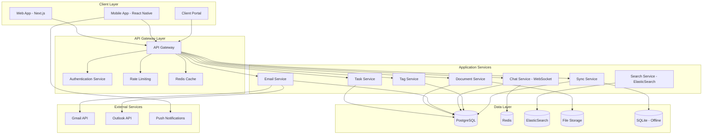

# Design Document

## Overview

The Zetra Platform enterprise-grade completion design focuses on transforming the existing foundation into a production-ready system that meets enterprise standards for security, performance, scalability, and user experience. The design leverages the existing Next.js + TypeScript + Prisma architecture while adding comprehensive testing, advanced features, and enterprise-grade infrastructure.

## Architecture

### System Architecture Enhancement



### Technology Stack Enhancements

**Frontend Enhancements:**
- Progressive Web App (PWA) capabilities
- Service Worker for offline functionality
- WebSocket integration for real-time features
- Advanced state management with Zustand
- Component library with Storybook documentation

**Backend Enhancements:**
- Microservices architecture with domain separation
- Event-driven architecture with message queues
- Comprehensive API documentation with OpenAPI
- Health checks and monitoring endpoints
- Graceful shutdown and error handling

**Infrastructure Enhancements:**
- Docker containerization
- Kubernetes orchestration
- CI/CD pipeline with automated testing
- Monitoring with Prometheus and Grafana
- Log aggregation with ELK stack

## Components and Interfaces

### Core Service Interfaces

#### Document Service Interface
```typescript
interface DocumentService {
  // File Operations
  uploadDocument(file: File, metadata: DocumentMetadata): Promise<Document>
  downloadDocument(id: string): Promise<Blob>
  previewDocument(id: string): Promise<PreviewData>
  
  // Version Management
  createVersion(documentId: string, file: File): Promise<DocumentVersion>
  getVersionHistory(documentId: string): Promise<DocumentVersion[]>
  rollbackToVersion(documentId: string, versionId: string): Promise<Document>
  
  // Collaboration
  addAnnotation(documentId: string, annotation: Annotation): Promise<Annotation>
  addComment(documentId: string, comment: Comment): Promise<Comment>
  shareDocument(documentId: string, shareConfig: ShareConfig): Promise<DocumentShare>
  
  // Organization
  createFolder(folderData: FolderData): Promise<DocumentFolder>
  moveDocument(documentId: string, folderId: string): Promise<Document>
  setPermissions(resourceId: string, permissions: Permission[]): Promise<void>
}
```

#### Task Workflow Engine Interface
```typescript
interface TaskWorkflowEngine {
  // Workflow Management
  createWorkflowTemplate(template: WorkflowTemplate): Promise<WorkflowTemplate>
  instantiateWorkflow(templateId: string, context: WorkflowContext): Promise<Workflow>
  
  // Task Operations
  createTask(taskData: TaskData): Promise<Task>
  updateTaskStatus(taskId: string, status: TaskStatus): Promise<Task>
  assignTask(taskId: string, assigneeId: string): Promise<Task>
  
  // Approval Workflows
  submitForApproval(taskId: string, approvers: string[]): Promise<ApprovalRequest>
  approveTask(approvalId: string, decision: ApprovalDecision): Promise<ApprovalResult>
  
  // Automation
  createRecurringTask(taskData: TaskData, schedule: Schedule): Promise<RecurringTask>
  triggerAutomation(triggerId: string, context: AutomationContext): Promise<void>
}
```

#### Email Integration Interface
```typescript
interface EmailIntegrationService {
  // Account Management
  connectAccount(provider: EmailProvider, credentials: EmailCredentials): Promise<EmailAccount>
  syncAccount(accountId: string): Promise<SyncResult>
  
  // Email Operations
  getEmails(accountId: string, filters: EmailFilters): Promise<Email[]>
  sendEmail(emailData: EmailData): Promise<Email>
  replyToEmail(emailId: string, replyData: ReplyData): Promise<Email>
  
  // Task Integration
  convertEmailToTask(emailId: string, taskData: Partial<TaskData>): Promise<Task>
  linkEmailToTask(emailId: string, taskId: string): Promise<void>
  
  // Search and Organization
  searchEmails(query: string, filters: SearchFilters): Promise<Email[]>
  organizeEmails(emailIds: string[], folderId: string): Promise<void>
}
```

#### Real-time Chat Interface
```typescript
interface ChatService {
  // Channel Management
  createChannel(channelData: ChannelData): Promise<ChatChannel>
  joinChannel(channelId: string, userId: string): Promise<void>
  leaveChannel(channelId: string, userId: string): Promise<void>
  
  // Messaging
  sendMessage(channelId: string, message: MessageData): Promise<ChatMessage>
  editMessage(messageId: string, content: string): Promise<ChatMessage>
  deleteMessage(messageId: string): Promise<void>
  
  // Real-time Features
  subscribeToChannel(channelId: string, callback: MessageCallback): Promise<Subscription>
  sendTypingIndicator(channelId: string, userId: string): Promise<void>
  
  // File Sharing
  shareFile(channelId: string, fileId: string): Promise<ChatMessage>
  shareTask(channelId: string, taskId: string): Promise<ChatMessage>
}
```

### Frontend Component Architecture

#### Advanced Task Board Component
```typescript
interface TaskBoardProps {
  viewMode: 'kanban' | 'list' | 'calendar' | 'timeline'
  filters: TaskFilters
  groupBy: 'status' | 'assignee' | 'priority' | 'dueDate'
  sortBy: TaskSortOptions
  onTaskUpdate: (task: Task) => void
  onTaskCreate: (task: Partial<Task>) => void
  onBulkAction: (taskIds: string[], action: BulkAction) => void
  enableDragDrop: boolean
  enableInlineEdit: boolean
  customColumns?: ColumnConfig[]
}

interface TaskBoardState {
  tasks: Task[]
  loading: boolean
  error: string | null
  selectedTasks: string[]
  draggedTask: Task | null
  viewSettings: ViewSettings
}
```

#### Document Management Component
```typescript
interface DocumentManagerProps {
  folderId?: string
  viewMode: 'grid' | 'list' | 'tree'
  enableUpload: boolean
  enablePreview: boolean
  enableCollaboration: boolean
  permissions: DocumentPermission[]
  onDocumentSelect: (document: Document) => void
  onFolderChange: (folderId: string) => void
}

interface DocumentManagerState {
  documents: Document[]
  folders: DocumentFolder[]
  currentFolder: DocumentFolder | null
  selectedDocuments: string[]
  uploadProgress: UploadProgress[]
  previewDocument: Document | null
}
```

## Data Models

### Enhanced Task Model
```typescript
interface Task {
  id: string
  organizationId: string
  title: string
  description?: string
  status: TaskStatus
  priority: TaskPriority
  assignedTo?: string
  createdBy: string
  parentTaskId?: string
  workflowId?: string
  templateId?: string
  
  // Time Tracking
  estimatedHours?: number
  actualHours?: number
  timeEntries: TimeEntry[]
  
  // Workflow
  approvalStatus?: ApprovalStatus
  approvers: string[]
  dependencies: TaskDependency[]
  
  // Scheduling
  dueDate?: Date
  startDate?: Date
  completedAt?: Date
  
  // Collaboration
  watchers: string[]
  comments: TaskComment[]
  attachments: TaskAttachment[]
  
  // Metadata
  tags: string[]
  customFields: Record<string, any>
  metadata: TaskMetadata
  
  // Audit
  createdAt: Date
  updatedAt: Date
  lockedAt?: Date
  lockedBy?: string
}
```

### Enhanced Document Model
```typescript
interface Document {
  id: string
  organizationId: string
  name: string
  originalName: string
  description?: string
  
  // File Information
  filePath: string
  localPath?: string
  cloudPath?: string
  thumbnailPath?: string
  fileSize: number
  mimeType: string
  checksum: string
  
  // Classification
  type: DocumentType
  status: DocumentStatus
  category: DocumentCategory
  confidentialityLevel: ConfidentialityLevel
  
  // Versioning
  version: number
  parentDocumentId?: string
  versionHistory: DocumentVersion[]
  
  // Organization
  folderId?: string
  folderPath: string
  tags: string[]
  
  // Collaboration
  annotations: DocumentAnnotation[]
  comments: DocumentComment[]
  shares: DocumentShare[]
  permissions: DocumentPermission[]
  
  // Content
  extractedText?: string
  ocrText?: string
  searchableContent: string
  
  // Metadata
  metadata: DocumentMetadata
  customFields: Record<string, any>
  
  // Audit
  uploadedBy: string
  uploadedAt: Date
  lastAccessedAt?: Date
  lastModifiedAt: Date
  createdAt: Date
  updatedAt: Date
  isDeleted: boolean
}
```

### Email Integration Model
```typescript
interface Email {
  id: string
  organizationId: string
  accountId: string
  
  // Email Identifiers
  externalId: string
  threadId?: string
  messageId: string
  
  // Content
  subject?: string
  fromAddress: string
  toAddresses: string[]
  ccAddresses: string[]
  bccAddresses: string[]
  bodyText?: string
  bodyHtml?: string
  
  // Attachments
  attachments: EmailAttachment[]
  
  // Classification
  folder: string
  labels: string[]
  importance: EmailImportance
  
  // Integration
  linkedTasks: string[]
  linkedDocuments: string[]
  tags: string[]
  
  // Timestamps
  receivedAt: Date
  sentAt?: Date
  syncedAt: Date
  createdAt: Date
  
  // Flags
  isRead: boolean
  isStarred: boolean
  isArchived: boolean
  isDeleted: boolean
}
```

## Error Handling

### Comprehensive Error Strategy

```typescript
// Error Types
enum ErrorType {
  VALIDATION_ERROR = 'VALIDATION_ERROR',
  AUTHENTICATION_ERROR = 'AUTHENTICATION_ERROR',
  AUTHORIZATION_ERROR = 'AUTHORIZATION_ERROR',
  NOT_FOUND_ERROR = 'NOT_FOUND_ERROR',
  CONFLICT_ERROR = 'CONFLICT_ERROR',
  RATE_LIMIT_ERROR = 'RATE_LIMIT_ERROR',
  EXTERNAL_SERVICE_ERROR = 'EXTERNAL_SERVICE_ERROR',
  SYNC_CONFLICT_ERROR = 'SYNC_CONFLICT_ERROR',
  OFFLINE_ERROR = 'OFFLINE_ERROR',
  INTERNAL_ERROR = 'INTERNAL_ERROR'
}

// Error Response Structure
interface ErrorResponse {
  success: false
  error: {
    type: ErrorType
    code: string
    message: string
    details?: any
    timestamp: string
    requestId: string
    retryable: boolean
  }
  meta?: {
    suggestions?: string[]
    documentation?: string
    supportContact?: string
  }
}

// Error Handling Middleware
class ErrorHandler {
  static handle(error: Error, context: RequestContext): ErrorResponse {
    // Log error with context
    logger.error('API Error', {
      error: error.message,
      stack: error.stack,
      context,
      timestamp: new Date().toISOString()
    })
    
    // Determine error type and create appropriate response
    if (error instanceof ValidationError) {
      return this.createValidationErrorResponse(error, context)
    }
    
    if (error instanceof AuthenticationError) {
      return this.createAuthErrorResponse(error, context)
    }
    
    // Default to internal error
    return this.createInternalErrorResponse(error, context)
  }
}
```

### Offline Error Handling

```typescript
class OfflineErrorHandler {
  static handleOfflineOperation(operation: OfflineOperation): OfflineResult {
    try {
      // Attempt operation with local data
      const result = this.executeOffline(operation)
      
      // Queue for sync when online
      this.queueForSync(operation)
      
      return {
        success: true,
        data: result,
        offline: true,
        syncPending: true
      }
    } catch (error) {
      return {
        success: false,
        error: {
          type: ErrorType.OFFLINE_ERROR,
          message: 'Operation failed in offline mode',
          details: error.message,
          retryWhenOnline: true
        }
      }
    }
  }
}
```

## Testing Strategy

### Comprehensive Testing Approach

#### Unit Testing Strategy
- **Coverage Target**: 95% line coverage, 90% branch coverage
- **Test Framework**: Jest with React Testing Library
- **Mock Strategy**: Mock external dependencies, test business logic in isolation
- **Test Organization**: Co-located tests with source files

#### Integration Testing Strategy
- **API Testing**: Test all API endpoints with real database
- **Service Integration**: Test service-to-service communication
- **Database Testing**: Test complex queries and transactions
- **External Service Testing**: Mock external APIs with realistic responses

#### End-to-End Testing Strategy
- **Framework**: Playwright for cross-browser testing
- **Scenarios**: Critical user journeys and workflows
- **Data Management**: Automated test data setup and cleanup
- **Visual Testing**: Screenshot comparison for UI consistency

#### Performance Testing Strategy
- **Load Testing**: Test concurrent user scenarios
- **Stress Testing**: Test system limits and failure modes
- **Database Performance**: Query optimization and indexing validation
- **Frontend Performance**: Bundle size, loading times, runtime performance

### Test Implementation Plan

```typescript
// Example Test Structure
describe('TaskService', () => {
  describe('createTask', () => {
    it('should create task with valid data', async () => {
      // Arrange
      const taskData = createValidTaskData()
      const mockUser = createMockUser()
      
      // Act
      const result = await taskService.createTask(taskData, mockUser)
      
      // Assert
      expect(result.success).toBe(true)
      expect(result.data).toMatchObject(taskData)
      expect(auditService.logAction).toHaveBeenCalledWith({
        action: 'CREATE_TASK',
        resourceId: result.data.id,
        userId: mockUser.id
      })
    })
    
    it('should handle validation errors', async () => {
      // Test validation error scenarios
    })
    
    it('should handle database errors', async () => {
      // Test database failure scenarios
    })
  })
})
```

## Performance Optimization

### Frontend Performance Strategy

#### Code Splitting and Lazy Loading
```typescript
// Route-based code splitting
const TaskBoard = lazy(() => import('./components/task/TaskBoard'))
const DocumentManager = lazy(() => import('./components/document/DocumentManager'))
const EmailInbox = lazy(() => import('./components/email/EmailInbox'))

// Component-based lazy loading
const LazyTaskForm = lazy(() => import('./components/task/TaskForm'))

// Preload critical routes
const preloadRoutes = () => {
  import('./components/task/TaskBoard')
  import('./components/document/DocumentManager')
}
```

#### State Management Optimization
```typescript
// Optimized Zustand store with selectors
interface TaskStore {
  tasks: Task[]
  filters: TaskFilters
  
  // Optimized selectors
  getTasksByStatus: (status: TaskStatus) => Task[]
  getOverdueTasks: () => Task[]
  getTasksByAssignee: (userId: string) => Task[]
  
  // Optimized actions
  updateTask: (id: string, updates: Partial<Task>) => void
  bulkUpdateTasks: (updates: BulkTaskUpdate[]) => void
}

// Memoized selectors
const selectTasksByStatus = useMemo(
  () => (state: TaskStore) => state.getTasksByStatus,
  []
)
```

### Backend Performance Strategy

#### Database Optimization
```sql
-- Optimized indexes for common queries
CREATE INDEX CONCURRENTLY idx_tasks_assignee_status ON tasks(assigned_to, status) WHERE assigned_to IS NOT NULL;
CREATE INDEX CONCURRENTLY idx_documents_folder_type ON documents(folder_id, type) WHERE is_deleted = false;
CREATE INDEX CONCURRENTLY idx_emails_account_received ON emails(account_id, received_at DESC);

-- Partial indexes for better performance
CREATE INDEX CONCURRENTLY idx_tasks_active ON tasks(organization_id, status, due_date) 
WHERE status IN ('TODO', 'IN_PROGRESS', 'IN_REVIEW');
```

#### Caching Strategy
```typescript
// Multi-level caching
class CacheService {
  // L1: In-memory cache (Redis)
  async getFromMemoryCache(key: string): Promise<any> {
    return await redis.get(key)
  }
  
  // L2: Application cache
  private appCache = new Map<string, CacheEntry>()
  
  // L3: Database query result cache
  async getCachedQuery(query: string, params: any[]): Promise<any> {
    const cacheKey = this.generateQueryCacheKey(query, params)
    return await this.getFromMemoryCache(cacheKey)
  }
  
  // Cache invalidation strategy
  async invalidateCache(pattern: string): Promise<void> {
    const keys = await redis.keys(pattern)
    if (keys.length > 0) {
      await redis.del(...keys)
    }
  }
}
```

## Security Implementation

### Authentication and Authorization

#### Multi-Factor Authentication
```typescript
class MFAService {
  async enableMFA(userId: string, method: MFAMethod): Promise<MFASetup> {
    const secret = this.generateTOTPSecret()
    const qrCode = await this.generateQRCode(secret, userId)
    
    await this.storeMFASecret(userId, secret, method)
    
    return {
      secret,
      qrCode,
      backupCodes: this.generateBackupCodes()
    }
  }
  
  async verifyMFA(userId: string, token: string): Promise<boolean> {
    const secret = await this.getMFASecret(userId)
    return this.verifyTOTPToken(secret, token)
  }
}
```

#### Role-Based Access Control Enhancement
```typescript
class PermissionService {
  async checkPermission(
    userId: string, 
    resource: string, 
    action: string,
    context?: PermissionContext
  ): Promise<boolean> {
    const user = await this.getUser(userId)
    const permissions = await this.getUserPermissions(user)
    
    // Check direct permissions
    if (permissions.includes(`${resource}:${action}`)) {
      return true
    }
    
    // Check contextual permissions
    if (context) {
      return await this.checkContextualPermission(user, resource, action, context)
    }
    
    return false
  }
  
  async enforcePermission(
    userId: string,
    resource: string,
    action: string,
    context?: PermissionContext
  ): Promise<void> {
    const hasPermission = await this.checkPermission(userId, resource, action, context)
    
    if (!hasPermission) {
      throw new AuthorizationError(`Insufficient permissions for ${resource}:${action}`)
    }
  }
}
```

### Data Encryption

#### End-to-End Encryption for Sensitive Data
```typescript
class EncryptionService {
  // Document encryption
  async encryptDocument(document: Buffer, userId: string): Promise<EncryptedDocument> {
    const userKey = await this.getUserEncryptionKey(userId)
    const documentKey = crypto.randomBytes(32)
    
    // Encrypt document with document key
    const encryptedContent = await this.encryptWithAES(document, documentKey)
    
    // Encrypt document key with user key
    const encryptedKey = await this.encryptWithRSA(documentKey, userKey.publicKey)
    
    return {
      encryptedContent,
      encryptedKey,
      algorithm: 'AES-256-GCM',
      keyAlgorithm: 'RSA-OAEP'
    }
  }
  
  // Field-level encryption for sensitive data
  async encryptSensitiveField(value: string, fieldType: string): Promise<string> {
    const fieldKey = await this.getFieldEncryptionKey(fieldType)
    return await this.encryptWithAES(value, fieldKey)
  }
}
```

This design provides a comprehensive foundation for transforming the Zetra Platform into an enterprise-grade product. The architecture emphasizes scalability, security, performance, and maintainability while building upon the existing solid foundation.