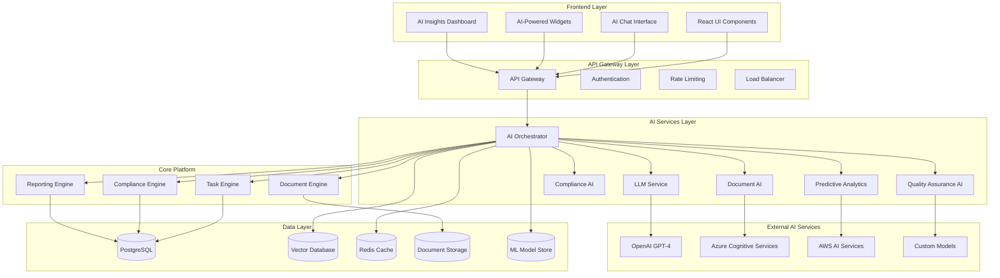
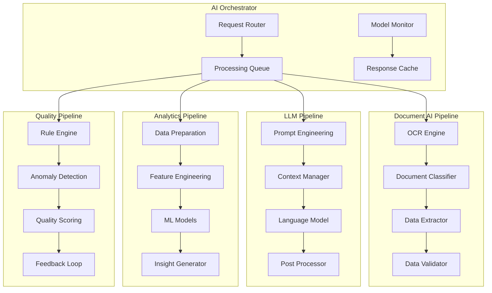

# AI Intelligence Platform - Design Document

## Overview

The AI Intelligence Platform transforms Zetra into a comprehensive AI-powered
productivity platform for CA firms. This design leverages cutting-edge AI
technologies including Large Language Models (LLMs), Computer Vision, Natural
Language Processing, and Machine Learning to automate routine tasks, provide
intelligent insights, and enhance decision-making capabilities.

## Architecture

### High-Level Architecture



### AI Service Architecture



## Components and Interfaces

### 1. AI Orchestrator Service

**Purpose:** Central coordination service for all AI operations

**Key Responsibilities:**

- Route AI requests to appropriate services
- Manage AI model lifecycle and versioning
- Handle fallback scenarios and error recovery
- Provide unified AI API interface
- Monitor AI service performance and costs

**Interface:**

```typescript
interface AIOrchestrator {
  processDocument(
    document: Document,
    options: ProcessingOptions
  ): Promise<DocumentAnalysis>
  generateInsights(data: AnalyticsData, type: InsightType): Promise<Insights>
  validateQuality(content: Content, rules: QualityRules): Promise<QualityReport>
  chatWithAssistant(
    message: string,
    context: ChatContext
  ): Promise<AssistantResponse>
  predictOutcome(
    scenario: Scenario,
    parameters: PredictionParams
  ): Promise<Prediction>
}
```

### 2. Document AI Service

**Purpose:** Intelligent document processing and analysis

**Key Features:**

- Multi-format document support (PDF, images, scanned documents)
- Intelligent OCR with context awareness
- Document classification and categorization
- Key information extraction
- Document comparison and analysis

**Interface:**

```typescript
interface DocumentAI {
  extractText(document: File): Promise<ExtractedText>
  classifyDocument(document: Document): Promise<DocumentClassification>
  extractKeyData(
    document: Document,
    schema: ExtractionSchema
  ): Promise<ExtractedData>
  compareDocuments(doc1: Document, doc2: Document): Promise<ComparisonResult>
  validateDocument(
    document: Document,
    rules: ValidationRules
  ): Promise<ValidationResult>
}
```

### 3. LLM Service

**Purpose:** Large Language Model integration for natural language tasks

**Key Features:**

- Multi-model support (GPT-4, Claude, Gemini)
- Context-aware conversations
- Professional writing assistance
- Code generation and explanation
- Regulatory guidance and interpretation

**Interface:**

```typescript
interface LLMService {
  generateResponse(prompt: string, context: Context): Promise<LLMResponse>
  summarizeContent(content: string, options: SummaryOptions): Promise<Summary>
  translateText(text: string, targetLanguage: string): Promise<Translation>
  generateCode(requirements: string, language: string): Promise<GeneratedCode>
  explainConcept(concept: string, audience: string): Promise<Explanation>
}
```

### 4. Predictive Analytics Service

**Purpose:** Machine learning-powered predictions and insights

**Key Features:**

- Revenue and cash flow forecasting
- Client churn prediction
- Resource demand forecasting
- Risk assessment and scoring
- Market trend analysis

**Interface:**

```typescript
interface PredictiveAnalytics {
  forecastRevenue(
    historicalData: FinancialData,
    period: TimePeriod
  ): Promise<RevenueForecast>
  predictChurn(clientData: ClientData): Promise<ChurnPrediction>
  assessRisk(scenario: RiskScenario): Promise<RiskAssessment>
  optimizeResources(constraints: ResourceConstraints): Promise<OptimizationPlan>
  analyzeTrends(data: TimeSeriesData): Promise<TrendAnalysis>
}
```

### 5. Compliance AI Service

**Purpose:** Automated compliance monitoring and validation

**Key Features:**

- Regulatory requirement tracking
- Compliance gap analysis
- Automated compliance checking
- Risk indicator detection
- Regulatory update monitoring

**Interface:**

```typescript
interface ComplianceAI {
  checkCompliance(
    document: Document,
    regulations: Regulation[]
  ): Promise<ComplianceReport>
  identifyRisks(data: ComplianceData): Promise<RiskIndicators>
  suggestActions(gaps: ComplianceGap[]): Promise<ActionPlan>
  monitorRegulations(jurisdiction: string): Promise<RegulatoryUpdates>
  validateFiling(filing: RegulatoryFiling): Promise<ValidationResult>
}
```

### 6. Quality Assurance AI Service

**Purpose:** Automated quality checking and improvement suggestions

**Key Features:**

- Work quality assessment
- Error detection and correction
- Consistency checking
- Best practice recommendations
- Performance improvement insights

**Interface:**

```typescript
interface QualityAI {
  assessQuality(
    work: WorkProduct,
    criteria: QualityCriteria
  ): Promise<QualityAssessment>
  detectErrors(content: Content): Promise<ErrorReport>
  suggestImprovements(work: WorkProduct): Promise<ImprovementSuggestions>
  checkConsistency(documents: Document[]): Promise<ConsistencyReport>
  benchmarkPerformance(metrics: PerformanceMetrics): Promise<BenchmarkReport>
}
```

## Data Models

### AI Processing Models

```typescript
// Document Analysis
interface DocumentAnalysis {
  id: string
  documentId: string
  documentType: DocumentType
  confidence: number
  extractedData: Record<string, any>
  insights: Insight[]
  qualityScore: number
  processingTime: number
  createdAt: Date
}

// AI Insights
interface AIInsight {
  id: string
  type: InsightType
  title: string
  description: string
  confidence: number
  impact: ImpactLevel
  recommendations: Recommendation[]
  dataPoints: DataPoint[]
  createdAt: Date
  expiresAt?: Date
}

// Chat Context
interface ChatContext {
  sessionId: string
  userId: string
  conversationHistory: ChatMessage[]
  currentContext: ContextData
  preferences: UserPreferences
  capabilities: string[]
}

// Prediction Model
interface PredictionModel {
  id: string
  name: string
  version: string
  type: ModelType
  accuracy: number
  lastTrained: Date
  features: Feature[]
  parameters: ModelParameters
  status: ModelStatus
}

// Quality Assessment
interface QualityAssessment {
  id: string
  workProductId: string
  overallScore: number
  dimensions: QualityDimension[]
  errors: QualityError[]
  suggestions: QualitySuggestion[]
  assessedAt: Date
  assessedBy: string
}
```

### AI Configuration Models

```typescript
// AI Service Configuration
interface AIServiceConfig {
  id: string
  serviceName: string
  provider: AIProvider
  modelName: string
  version: string
  endpoint: string
  apiKey: string
  rateLimits: RateLimit
  fallbackService?: string
  enabled: boolean
}

// Processing Pipeline
interface ProcessingPipeline {
  id: string
  name: string
  steps: PipelineStep[]
  inputSchema: JSONSchema
  outputSchema: JSONSchema
  errorHandling: ErrorHandlingConfig
  monitoring: MonitoringConfig
}

// AI Model Registry
interface AIModelRegistry {
  id: string
  modelName: string
  version: string
  type: ModelType
  provider: string
  capabilities: string[]
  performance: PerformanceMetrics
  costs: CostMetrics
  deployment: DeploymentConfig
}
```

## Error Handling

### AI Service Error Handling Strategy

```typescript
class AIErrorHandler {
  async handleError(
    error: AIError,
    context: ErrorContext
  ): Promise<ErrorResponse> {
    switch (error.type) {
      case 'MODEL_UNAVAILABLE':
        return this.handleModelUnavailable(error, context)
      case 'RATE_LIMIT_EXCEEDED':
        return this.handleRateLimit(error, context)
      case 'INSUFFICIENT_CONTEXT':
        return this.handleInsufficientContext(error, context)
      case 'PROCESSING_TIMEOUT':
        return this.handleTimeout(error, context)
      case 'QUALITY_THRESHOLD_NOT_MET':
        return this.handleQualityIssue(error, context)
      default:
        return this.handleGenericError(error, context)
    }
  }

  private async handleModelUnavailable(
    error: AIError,
    context: ErrorContext
  ): Promise<ErrorResponse> {
    // Try fallback model
    const fallbackModel = await this.getFallbackModel(context.modelType)
    if (fallbackModel) {
      return { action: 'RETRY_WITH_FALLBACK', fallbackModel }
    }
    return { action: 'QUEUE_FOR_LATER', retryAfter: 300 }
  }

  private async handleRateLimit(
    error: AIError,
    context: ErrorContext
  ): Promise<ErrorResponse> {
    // Implement exponential backoff
    const backoffTime = this.calculateBackoff(context.retryCount)
    return { action: 'RETRY_AFTER_DELAY', delay: backoffTime }
  }
}
```

### Fallback Mechanisms

1. **Model Fallback:** Automatic switching to backup AI models
2. **Degraded Service:** Provide limited functionality when AI is unavailable
3. **Human Handoff:** Route complex cases to human experts
4. **Cached Responses:** Use previously computed results when appropriate
5. **Queue Processing:** Defer non-critical AI tasks during outages

## Testing Strategy

### AI Testing Framework

```typescript
class AITestFramework {
  // Model Performance Testing
  async testModelAccuracy(
    model: AIModel,
    testDataset: TestDataset
  ): Promise<AccuracyReport> {
    const predictions = await model.predict(testDataset.inputs)
    return this.calculateAccuracy(predictions, testDataset.expectedOutputs)
  }

  // Bias Testing
  async testModelBias(
    model: AIModel,
    biasTestSuite: BiasTestSuite
  ): Promise<BiasReport> {
    const results = await Promise.all(
      biasTestSuite.testCases.map(testCase => this.runBiasTest(model, testCase))
    )
    return this.compileBiasReport(results)
  }

  // Integration Testing
  async testAIIntegration(
    service: AIService,
    integrationTests: IntegrationTest[]
  ): Promise<IntegrationReport> {
    const results = await Promise.all(
      integrationTests.map(test => this.runIntegrationTest(service, test))
    )
    return this.compileIntegrationReport(results)
  }

  // Performance Testing
  async testAIPerformance(
    service: AIService,
    loadProfile: LoadProfile
  ): Promise<PerformanceReport> {
    const metrics = await this.runLoadTest(service, loadProfile)
    return this.analyzePerformanceMetrics(metrics)
  }
}
```

### Testing Categories

1. **Unit Tests:** Individual AI component testing
2. **Integration Tests:** AI service integration testing
3. **Performance Tests:** Load and stress testing for AI services
4. **Accuracy Tests:** Model prediction accuracy validation
5. **Bias Tests:** Fairness and bias detection in AI models
6. **Security Tests:** AI-specific security vulnerability testing
7. **Regression Tests:** Model performance regression detection

## Security Considerations

### AI Security Framework

1. **Data Privacy:**
   - Encrypt all data sent to AI services
   - Implement data anonymization for sensitive information
   - Ensure compliance with GDPR and other privacy regulations
   - Provide data deletion capabilities

2. **Model Security:**
   - Secure model storage and versioning
   - Implement model access controls
   - Monitor for model poisoning attacks
   - Validate model integrity

3. **API Security:**
   - Implement strong authentication for AI services
   - Use rate limiting to prevent abuse
   - Monitor for unusual usage patterns
   - Implement request/response validation

4. **Audit and Compliance:**
   - Log all AI decisions and recommendations
   - Provide explainability for AI outputs
   - Implement audit trails for model changes
   - Ensure regulatory compliance for AI usage

### AI Ethics and Governance

```typescript
interface AIGovernanceFramework {
  ethicsGuidelines: EthicsGuideline[]
  biasMonitoring: BiasMonitoringConfig
  explainabilityRequirements: ExplainabilityConfig
  humanOversight: HumanOversightConfig
  auditRequirements: AuditConfig
  complianceFramework: ComplianceFramework
}

class AIEthicsMonitor {
  async monitorBias(
    model: AIModel,
    monitoringConfig: BiasMonitoringConfig
  ): Promise<BiasReport> {
    // Implement bias detection and monitoring
  }

  async ensureExplainability(
    decision: AIDecision,
    requirements: ExplainabilityConfig
  ): Promise<Explanation> {
    // Generate explanations for AI decisions
  }

  async validateEthicalCompliance(
    aiOperation: AIOperation
  ): Promise<EthicsComplianceReport> {
    // Validate AI operations against ethics guidelines
  }
}
```

## Performance Optimization

### AI Performance Strategy

1. **Caching Strategy:**
   - Cache frequently requested AI responses
   - Implement semantic caching for similar queries
   - Use distributed caching for scalability

2. **Model Optimization:**
   - Use model quantization for faster inference
   - Implement model pruning for reduced size
   - Use specialized hardware (GPUs, TPUs) when available

3. **Request Optimization:**
   - Batch similar requests for efficiency
   - Implement request deduplication
   - Use asynchronous processing for non-critical tasks

4. **Resource Management:**
   - Implement auto-scaling for AI services
   - Use resource pooling for model instances
   - Monitor and optimize resource utilization

### Monitoring and Observability

```typescript
interface AIMonitoringSystem {
  modelPerformance: ModelPerformanceMonitor
  serviceHealth: ServiceHealthMonitor
  costTracking: CostTrackingMonitor
  qualityMetrics: QualityMetricsMonitor
  userExperience: UserExperienceMonitor
}

class AIMetricsCollector {
  async collectModelMetrics(model: AIModel): Promise<ModelMetrics> {
    return {
      accuracy: await this.measureAccuracy(model),
      latency: await this.measureLatency(model),
      throughput: await this.measureThroughput(model),
      resourceUsage: await this.measureResourceUsage(model),
      errorRate: await this.measureErrorRate(model),
    }
  }

  async collectServiceMetrics(service: AIService): Promise<ServiceMetrics> {
    return {
      availability: await this.measureAvailability(service),
      responseTime: await this.measureResponseTime(service),
      requestVolume: await this.measureRequestVolume(service),
      errorDistribution: await this.measureErrorDistribution(service),
      costPerRequest: await this.measureCostPerRequest(service),
    }
  }
}
```

This comprehensive design provides the foundation for building a world-class
AI-powered CA platform that will significantly enhance productivity, accuracy,
and client service quality.