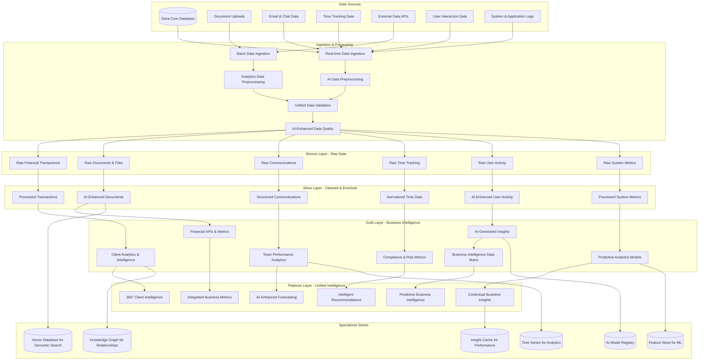

# Unified AI-Powered Analytics Platform - Design Document

## Overview

The Unified AI-Powered Analytics Platform transforms Zetra into the ultimate intelligent productivity and analytics platform for CA firms. This design integrates advanced AI capabilities with comprehensive analytics to create a synergistic system that provides unprecedented business intelligence, automation, and decision-making capabilities.

The unified platform architecture combines:
- **AI Intelligence Layer:** Document processing, task automation, conversational AI, quality assurance
- **Analytics Engine Layer:** Real-time business intelligence, predictive analytics, advanced reporting
- **Unified Data Layer:** Integrated data processing supporting both AI and analytics workloads
- **Intelligent Insights Layer:** AI-enhanced analytics with contextual intelligence and automated insights

## Architecture

### High-Level Unified Architecture

```mermaid
graph TB
    subgraph "Presentation Layer"
        WebUI[Web UI Components]
        MobileUI[Mobile UI]
        AIChat[AI Chat Interface]
        Dashboards[Analytics Dashboards]
        Reports[Interactive Reports]
        AIWidgets[AI-Powered Widgets]
    end

    subgraph "API Gateway & Orchestration"
        APIGateway[API Gateway]
        AIOrchestrator[AI Orchestrator]
        AnalyticsOrchestrator[Analytics Orchestrator]
        UnifiedOrchestrator[Unified Service Orchestrator]
        Auth[Authentication & Authorization]
        RateLimit[Rate Limiting & Throttling]
    end

    subgraph "AI Services Layer"
        DocumentAI[Document AI Service]
        LLMService[LLM Service]
        ConversationalAI[Conversational AI]
        PredictiveAI[Predictive AI Service]
        QualityAI[Quality Assurance AI]
        ComplianceAI[Compliance AI]
        WorkflowAI[Workflow Intelligence AI]
    end

    subgraph "Analytics Services Layer"
        AnalyticsEngine[Analytics Engine]
        ReportingEngine[Reporting Engine]
        VisualizationEngine[Visualization Engine]
        KPIEngine[KPI Calculation Engine]
        ForecastingEngine[Forecasting Engine]
        BIEngine[Business Intelligence Engine]
    end

    subgraph "Unified Intelligence Layer"
        InsightFusion[AI-Analytics Insight Fusion]
        ContextEngine[Context Intelligence Engine]
        RecommendationEngine[Unified Recommendation Engine]
        AnomalyDetection[AI-Enhanced Anomaly Detection]
        PatternRecognition[Pattern Recognition Engine]
    end

    subgraph "Data Processing Layer"
        StreamProcessor[Real-time Stream Processing]
        BatchProcessor[Batch Processing Engine]
        AIDataProcessor[AI Data Processing Pipeline]
        AnalyticsProcessor[Analytics Data Pipeline]
        DataQualityEngine[AI-Enhanced Data Quality]
        ETLPipeline[ETL/ELT Pipeline]
    end

    subgraph "Unified Data Layer"
        DataLake[(Data Lake - Bronze/Silver/Gold)]
        DataWarehouse[(Analytics Data Warehouse)]
        VectorDB[(Vector Database for AI)]
        GraphDB[(Knowledge Graph Database)]
        TimeSeriesDB[(Time Series Database)]
        CacheLayer[(Redis Cache Layer)]
        MLModelStore[(ML Model Store)]
        MetadataStore[(Unified Metadata Store)]
    end

    subgraph "External Services"
        OpenAI[OpenAI Services]
        AzureCognitive[Azure Cognitive Services]
        AWSMachineLearning[AWS ML Services]
        ExternalData[External Data Sources]
        APIIntegrations[Third-party API Integrations]
    end

    subgraph "Infrastructure Layer"
        Monitoring[Unified Monitoring & Observability]
        Security[Security & Compliance Framework]
        Logging[Centralized Logging]
        Backup[Backup & Recovery]
        Scaling[Auto-scaling & Load Management]
    end

    WebUI --> APIGateway
    MobileUI --> APIGateway
    AIChat --> APIGateway
    Dashboards --> APIGateway
    Reports --> APIGateway
    AIWidgets --> APIGateway

    APIGateway --> UnifiedOrchestrator
    UnifiedOrchestrator --> AIOrchestrator
    UnifiedOrchestrator --> AnalyticsOrchestrator

    AIOrchestrator --> DocumentAI
    AIOrchestrator --> LLMService
    AIOrchestrator --> ConversationalAI
    AIOrchestrator --> PredictiveAI
    AIOrchestrator --> QualityAI
    AIOrchestrator --> ComplianceAI
    AIOrchestrator --> WorkflowAI

    AnalyticsOrchestrator --> AnalyticsEngine
    AnalyticsOrchestrator --> ReportingEngine
    AnalyticsOrchestrator --> VisualizationEngine
    AnalyticsOrchestrator --> KPIEngine
    AnalyticsOrchestrator --> ForecastingEngine
    AnalyticsOrchestrator --> BIEngine

    UnifiedOrchestrator --> InsightFusion
    InsightFusion --> ContextEngine
    InsightFusion --> RecommendationEngine
    InsightFusion --> AnomalyDetection
    InsightFusion --> PatternRecognition

    AIOrchestrator --> StreamProcessor
    AnalyticsOrchestrator --> BatchProcessor
    StreamProcessor --> AIDataProcessor
    BatchProcessor --> AnalyticsProcessor
    AIDataProcessor --> DataQualityEngine
    AnalyticsProcessor --> ETLPipeline

    DataQualityEngine --> DataLake
    ETLPipeline --> DataWarehouse
    AIDataProcessor --> VectorDB
    AnalyticsProcessor --> TimeSeriesDB
    InsightFusion --> GraphDB
    UnifiedOrchestrator --> CacheLayer
    AIOrchestrator --> MLModelStore
    AnalyticsOrchestrator --> MetadataStore

    DocumentAI --> AzureCognitive
    LLMService --> OpenAI
    PredictiveAI --> AWSMachineLearning
    AnalyticsEngine --> ExternalData
    BIEngine --> APIIntegrations

    UnifiedOrchestrator --> Monitoring
    UnifiedOrchestrator --> Security
    UnifiedOrchestrator --> Logging
    DataLake --> Backup
    UnifiedOrchestrator --> Scaling
```



### Data Architecture - Unified Intelligence Data Flow



## Core Components and Interfaces

### 1. Unified Service Orchestrator

**Purpose:** Central coordination hub for all AI and analytics operations with intelligent routing and optimization

**Key Responsibilities:**
- Coordinate between AI and analytics services
- Optimize resource allocation across workloads
- Provide unified API interface
- Manage cross-service data flows
- Handle intelligent caching and performance optimization

**Interface:**

```typescript
interface UnifiedServiceOrchestrator {
  // Unified Processing
  processUnifiedRequest(
    request: UnifiedRequest,
    context: ProcessingContext
  ): Promise<UnifiedResponse>
  
  // AI-Analytics Integration
  executeAIEnhancedAnalytics(
    analyticsQuery: AnalyticsQuery,
    aiEnhancements: AIEnhancement[]
  ): Promise<EnhancedAnalyticsResult>
  
  // Intelligent Routing
  routeRequest(
    request: ServiceRequest,
    routing: IntelligentRouting
  ): Promise<RoutingDecision>
  
  // Cross-Service Insights
  generateUnifiedInsights(
    data: UnifiedDataSet,
    insightTypes: InsightType[]
  ): Promise<UnifiedInsight[]>
  
  // Performance Optimization
  optimizeResourceAllocation(
    workloads: ServiceWorkload[]
  ): Promise<OptimizationPlan>
}
```

### 2. AI-Enhanced Analytics Engine

**Purpose:** Advanced analytics engine enhanced with AI capabilities for intelligent data processing and insight generation

**Interface:**

```typescript
interface AIEnhancedAnalyticsEngine {
  // AI-Enhanced Queries
  executeIntelligentQuery(
    query: AnalyticsQuery,
    aiContext: AIContext
  ): Promise<IntelligentQueryResult>
  
  // Automated Insight Discovery
  discoverInsights(
    data: Dataset,
    discoveryConfig: InsightDiscoveryConfig
  ): Promise<AutomatedInsight[]>
  
  // Predictive Analytics with AI
  generatePredictions(
    historicalData: TimeSeriesData,
    predictionConfig: PredictionConfig,
    aiModels: AIModel[]
  ): Promise<AIPoweredPrediction>
  
  // Anomaly Detection
  detectAnomalies(
    data: Dataset,
    anomalyConfig: AnomalyConfig
  ): Promise<AnomalyDetectionResult>
  
  // Natural Language Analytics
  processNaturalLanguageQuery(
    query: string,
    context: AnalyticsContext
  ): Promise<NLQueryResult>
}
```

### 3. Document Intelligence Service

**Purpose:** Comprehensive document processing combining AI extraction with analytics insights

**Interface:**

```typescript
interface DocumentIntelligenceService {
  // Intelligent Document Processing
  processDocumentWithAnalytics(
    document: Document,
    processingOptions: DocumentProcessingOptions
  ): Promise<DocumentIntelligenceResult>
  
  // Document Analytics
  generateDocumentAnalytics(
    documents: Document[],
    analyticsConfig: DocumentAnalyticsConfig
  ): Promise<DocumentAnalytics>
  
  // Content Intelligence
  extractContentIntelligence(
    document: Document,
    extractionRules: IntelligenceExtractionRule[]
  ): Promise<ContentIntelligence>
  
  // Document Insights
  generateDocumentInsights(
    documentData: DocumentData,
    insightTypes: DocumentInsightType[]
  ): Promise<DocumentInsight[]>
  
  // Compliance Analysis
  analyzeComplianceWithIntelligence(
    document: Document,
    regulations: Regulation[]
  ): Promise<IntelligentComplianceAnalysis>
}
```

### 4. Conversational Analytics Assistant

**Purpose:** AI assistant enhanced with analytics capabilities for intelligent business guidance

**Interface:**

```typescript
interface ConversationalAnalyticsAssistant {
  // Analytics-Aware Conversations
  chatWithAnalyticsContext(
    message: string,
    context: AnalyticsAwareChatContext
  ): Promise<AnalyticsEnhancedResponse>
  
  // Business Intelligence Queries
  answerBusinessIntelligenceQuery(
    query: string,
    biContext: BusinessIntelligenceContext
  ): Promise<BIQueryResponse>
  
  // Data Interpretation
  interpretAnalyticsResults(
    results: AnalyticsResult[],
    interpretationContext: InterpretationContext
  ): Promise<DataInterpretation>
  
  // Recommendation Generation
  generateBusinessRecommendations(
    businessContext: BusinessContext,
    dataInsights: DataInsight[]
  ): Promise<BusinessRecommendation[]>
  
  // Predictive Guidance
  providePredictiveGuidance(
    scenario: BusinessScenario,
    predictiveData: PredictiveData
  ): Promise<PredictiveGuidance>
}
```

### 5. Intelligent Reporting Engine

**Purpose:** Advanced reporting system with AI-generated insights and analytics-driven narratives

**Interface:**

```typescript
interface IntelligentReportingEngine {
  // AI-Enhanced Report Generation
  generateIntelligentReport(
    template: ReportTemplate,
    data: ReportData,
    aiEnhancements: AIEnhancement[]
  ): Promise<IntelligentReport>
  
  // Automated Insight Narratives
  generateInsightNarrative(
    insights: Insight[],
    narrativeStyle: NarrativeStyle
  ): Promise<InsightNarrative>
  
  // Dynamic Report Optimization
  optimizeReportContent(
    report: Report,
    audience: Audience,
    objectives: ReportObjective[]
  ): Promise<OptimizedReport>
  
  // Interactive Report Intelligence
  enhanceReportInteractivity(
    report: Report,
    interactivityConfig: InteractivityConfig
  ): Promise<InteractiveIntelligentReport>
  
  // Report Performance Analytics
  analyzeReportPerformance(
    reportUsage: ReportUsageData,
    performanceMetrics: PerformanceMetric[]
  ): Promise<ReportPerformanceAnalysis>
}
```

### 6. Unified Insight Fusion Engine

**Purpose:** Central intelligence engine that combines AI and analytics insights for unified business intelligence

**Interface:**

```typescript
interface UnifiedInsightFusionEngine {
  // Insight Integration
  fuseInsights(
    aiInsights: AIInsight[],
    analyticsInsights: AnalyticsInsight[],
    fusionConfig: InsightFusionConfig
  ): Promise<UnifiedInsight[]>
  
  // Context-Aware Intelligence
  generateContextualIntelligence(
    businessContext: BusinessContext,
    dataContext: DataContext,
    userContext: UserContext
  ): Promise<ContextualIntelligence>
  
  // Predictive Business Intelligence
  generatePredictiveBI(
    historicalInsights: HistoricalInsight[],
    currentContext: BusinessContext,
    predictionHorizon: TimePeriod
  ): Promise<PredictiveBusinessIntelligence>
  
  // Strategic Recommendations
  generateStrategicRecommendations(
    businessObjectives: BusinessObjective[],
    marketIntelligence: MarketIntelligence,
    operationalData: OperationalData
  ): Promise<StrategicRecommendation[]>
  
  // Intelligence Validation
  validateIntelligence(
    intelligence: Intelligence,
    validationCriteria: ValidationCriteria
  ): Promise<IntelligenceValidationResult>
}
```

## Data Models

### Unified Intelligence Models

```typescript
// Unified Data Processing Models
interface UnifiedDataSet {
  id: string
  sourceTypes: DataSourceType[]
  aiProcessedData: AIProcessedData
  analyticsData: AnalyticsData
  metaData: UnifiedMetaData
  qualityScore: DataQualityScore
  processingTimestamp: Date
  enrichmentLevel: EnrichmentLevel
}

interface IntelligentQueryResult {
  id: string
  queryId: string
  results: QueryResult[]
  aiEnhancements: AIEnhancement[]
  insights: AutomatedInsight[]
  recommendations: IntelligentRecommendation[]
  confidence: ConfidenceScore
  executionMetrics: QueryExecutionMetrics
  nextSteps: SuggestedAction[]
}

interface UnifiedInsight {
  id: string
  type: InsightType
  source: InsightSource[]
  title: string
  description: string
  impact: BusinessImpact
  confidence: ConfidenceScore
  evidence: Evidence[]
  recommendations: ActionableRecommendation[]
  relatedInsights: RelatedInsight[]
  validationStatus: ValidationStatus
  createdAt: Date
  expiresAt?: Date
}
```

### AI-Enhanced Analytics Models

```typescript
// Business Intelligence Models
interface PredictiveBusinessIntelligence {
  id: string
  predictionType: PredictionType
  timeHorizon: TimePeriod
  predictions: Prediction[]
  confidence: ConfidenceInterval
  assumptions: ModelAssumption[]
  scenarios: Scenario[]
  risksAndOpportunities: RiskOpportunity[]
  recommendedActions: ActionPlan[]
  monitoringMetrics: MonitoringMetric[]
}

interface ContextualIntelligence {
  id: string
  contextType: ContextType
  businessContext: BusinessContextData
  dataContext: DataContextData
  userContext: UserContextData
  situationalAwareness: SituationalData
  applicableInsights: Insight[]
  contextualRecommendations: ContextualRecommendation[]
  adaptationStrategies: AdaptationStrategy[]
}

interface IntelligentReport {
  id: string
  templateId: string
  title: string
  executiveSummary: AIGeneratedSummary
  keyInsights: KeyInsight[]
  dataVisualizations: IntelligentVisualization[]
  narrativeContent: AIGeneratedNarrative
  recommendations: ActionableRecommendation[]
  appendices: ReportAppendix[]
  interactiveElements: InteractiveElement[]
  metadata: ReportMetadata
}
```

### Document Intelligence Models

```typescript
// Document Processing Models
interface DocumentIntelligenceResult {
  id: string
  documentId: string
  processingType: ProcessingType
  extractedData: ExtractedDataWithConfidence
  documentClassification: AIDocumentClassification
  contentAnalysis: ContentAnalysisResult
  complianceAssessment: ComplianceAssessment
  qualityMetrics: DocumentQualityMetrics
  insights: DocumentInsight[]
  recommendations: DocumentRecommendation[]
  processingMetadata: ProcessingMetadata
}

interface ContentIntelligence {
  id: string
  contentType: ContentType
  keyEntities: ExtractedEntity[]
  relationships: EntityRelationship[]
  sentiment: SentimentAnalysis
  topics: TopicAnalysis
  compliance: ComplianceAnalysis
  risks: RiskIndicator[]
  opportunities: OpportunityIndicator[]
  actionItems: ActionItem[]
}
```

### Conversational Analytics Models

```typescript
// Conversational AI Models
interface AnalyticsEnhancedResponse {
  id: string
  response: string
  analyticsContext: AnalyticsContext
  supportingData: SupportingDataVisualization[]
  relatedInsights: RelatedInsight[]
  followUpQuestions: SuggestedQuestion[]
  actionableItems: ActionableItem[]
  confidenceLevel: ConfidenceLevel
  sources: InformationSource[]
}

interface BusinessRecommendation {
  id: string
  type: RecommendationType
  title: string
  description: string
  rationale: RecommendationRationale
  expectedImpact: ExpectedImpact
  implementationPlan: ImplementationPlan
  resources: RequiredResource[]
  timeline: ImplementationTimeline
  successMetrics: SuccessMetric[]
  risks: ImplementationRisk[]
}
```

## Error Handling and Resilience

### Unified Error Handling Strategy

```typescript
class UnifiedErrorHandler {
  async handleError(
    error: UnifiedError,
    context: UnifiedErrorContext
  ): Promise<UnifiedErrorResponse> {
    switch (error.category) {
      case 'AI_SERVICE_ERROR':
        return this.handleAIServiceError(error, context)
      case 'ANALYTICS_ERROR':
        return this.handleAnalyticsError(error, context)
      case 'DATA_QUALITY_ERROR':
        return this.handleDataQualityError(error, context)
      case 'INTEGRATION_ERROR':
        return this.handleIntegrationError(error, context)
      case 'PERFORMANCE_DEGRADATION':
        return this.handlePerformanceDegradation(error, context)
      default:
        return this.handleGenericError(error, context)
    }
  }

  private async handleAIServiceError(
    error: UnifiedError,
    context: UnifiedErrorContext
  ): Promise<UnifiedErrorResponse> {
    // Implement AI service fallback with analytics continuation
    const fallbackStrategy = await this.determineAIFallbackStrategy(error, context)
    const analyticsAlternative = await this.getAnalyticsAlternative(context)
    
    return {
      action: 'FALLBACK_WITH_ANALYTICS_CONTINUATION',
      fallbackStrategy,
      analyticsAlternative,
      degradationLevel: this.calculateDegradationLevel(error)
    }
  }

  private async handleAnalyticsError(
    error: UnifiedError,
    context: UnifiedErrorContext
  ): Promise<UnifiedErrorResponse> {
    // Implement analytics fallback with AI assistance
    const cachedResults = await this.getCachedAnalyticsResults(context)
    const aiAssistance = await this.getAIAssistedAnalytics(context)
    
    return {
      action: 'USE_CACHED_WITH_AI_ASSISTANCE',
      cachedResults,
      aiAssistance,
      recommendedActions: await this.generateRecoveryActions(error)
    }
  }
}
```

## Performance Optimization

### Unified Performance Strategy

```typescript
class UnifiedPerformanceOptimizer {
  async optimizeUnifiedWorkload(
    workload: UnifiedWorkload
  ): Promise<OptimizedWorkload> {
    // Analyze workload characteristics
    const analysis = await this.analyzeWorkloadCharacteristics(workload)
    
    // Apply AI-specific optimizations
    const aiOptimizations = await this.optimizeAIProcessing(workload.aiTasks)
    
    // Apply analytics-specific optimizations
    const analyticsOptimizations = await this.optimizeAnalyticsProcessing(
      workload.analyticsTasks
    )
    
    // Cross-optimize between AI and analytics
    const crossOptimizations = await this.optimizeCrossServiceSynergies(
      workload
    )
    
    return this.combineOptimizations(
      aiOptimizations,
      analyticsOptimizations,
      crossOptimizations
    )
  }

  async implementIntelligentCaching(
    request: UnifiedRequest
  ): Promise<CachingStrategy> {
    // AI-enhanced cache key generation
    const cacheKey = await this.generateIntelligentCacheKey(request)
    
    // Predictive cache warming based on usage patterns
    const warmingStrategy = await this.predictCacheWarmingNeeds(request)
    
    // Cross-service cache optimization
    const crossServiceCache = await this.optimizeCrossServiceCaching(request)
    
    return {
      cacheKey,
      warmingStrategy,
      crossServiceCache,
      ttl: await this.calculateOptimalTTL(request)
    }
  }
}
```

## Security and Compliance

### Unified Security Framework

```typescript
interface UnifiedSecurityFramework {
  // AI-Analytics Security Integration
  validateUnifiedAccess(
    userId: string,
    requestType: UnifiedRequestType,
    resourcePath: string
  ): Promise<UnifiedAccessDecision>
  
  // Data Protection Across Services
  protectSensitiveData(
    data: SensitiveData,
    protectionLevel: ProtectionLevel,
    serviceTypes: ServiceType[]
  ): Promise<ProtectedData>
  
  // Audit Trail Integration
  logUnifiedActivity(
    activity: UnifiedActivity,
    auditLevel: AuditLevel
  ): Promise<void>
  
  // Compliance Validation
  validateComplianceAcrossServices(
    operation: UnifiedOperation,
    complianceFrameworks: ComplianceFramework[]
  ): Promise<ComplianceValidationResult>
}
```

## Testing Strategy

### Unified Testing Framework

```typescript
class UnifiedTestingFramework {
  // Integration Testing for AI-Analytics
  async testAIAnalyticsIntegration(
    testScenarios: IntegrationTestScenario[]
  ): Promise<IntegrationTestResult[]> {
    const results = await Promise.all(
      testScenarios.map(scenario => this.runIntegrationTest(scenario))
    )
    return this.compileIntegrationResults(results)
  }

  // End-to-End Workflow Testing
  async testUnifiedWorkflows(
    workflows: UnifiedWorkflow[]
  ): Promise<WorkflowTestResult[]> {
    const results = await Promise.all(
      workflows.map(workflow => this.testWorkflow(workflow))
    )
    return this.analyzeWorkflowResults(results)
  }

  // Performance Testing Across Services
  async testUnifiedPerformance(
    performanceProfile: UnifiedPerformanceProfile
  ): Promise<UnifiedPerformanceReport> {
    const aiPerformance = await this.testAIPerformance(performanceProfile.aiWorkload)
    const analyticsPerformance = await this.testAnalyticsPerformance(
      performanceProfile.analyticsWorkload
    )
    const integrationPerformance = await this.testIntegrationPerformance(
      performanceProfile.integrationWorkload
    )
    
    return this.combinePerformanceResults(
      aiPerformance,
      analyticsPerformance,
      integrationPerformance
    )
  }
}
```

This unified design creates a comprehensive platform that leverages the synergies between AI and analytics to deliver unprecedented business intelligence and automation capabilities for CA firms. The architecture ensures seamless integration while maintaining the distinct advantages of both AI and analytics technologies.