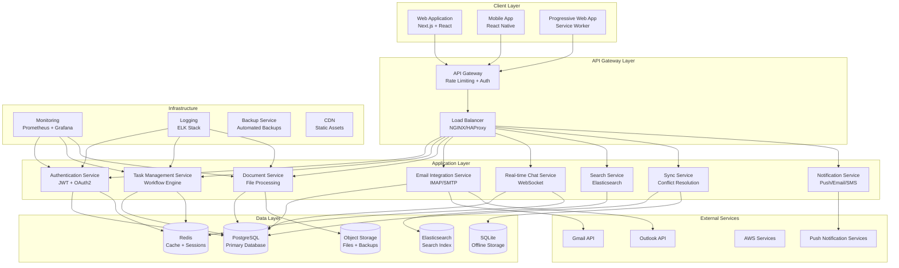

# System Architecture Overview

This document provides a comprehensive overview of the Zetra Platform's system
architecture, designed to support enterprise-grade productivity workflows for CA
firms.

## Architecture Principles

### 1. Scalability First

- Horizontal scaling capabilities
- Microservices-ready architecture
- Database sharding support
- Load balancing and auto-scaling

### 2. Security by Design

- Zero-trust security model
- End-to-end encryption
- Role-based access control
- Comprehensive audit logging

### 3. Offline-First

- Local data synchronization
- Conflict resolution mechanisms
- Progressive sync capabilities
- Offline-capable mobile apps

### 4. Performance Optimized

- Multi-level caching strategies
- Database query optimization
- CDN integration
- Bundle optimization

## High-Level Architecture



## Component Architecture

### Frontend Architecture

#### Web Application (Next.js)

```
src/
├── app/                    # Next.js 14 App Router
│   ├── (auth)/            # Authentication routes
│   ├── (dashboard)/       # Main application routes
│   ├── api/               # API routes
│   └── globals.css        # Global styles
├── components/            # React components
│   ├── ui/               # Base UI components
│   ├── forms/            # Form components
│   ├── layout/           # Layout components
│   └── features/         # Feature-specific components
├── lib/                  # Utility libraries
│   ├── auth.ts           # Authentication logic
│   ├── api-client.ts     # API client
│   ├── utils.ts          # Utility functions
│   └── validations.ts    # Form validations
├── hooks/                # Custom React hooks
├── stores/               # State management (Zustand)
├── types/                # TypeScript definitions
└── styles/               # Styling files
```

#### State Management Strategy

- **Zustand**: Primary state management for complex state
- **React Query**: Server state management and caching
- **React Hook Form**: Form state management
- **Local Storage**: Persistent client-side storage

#### Component Design Patterns

- **Compound Components**: Complex UI components
- **Render Props**: Flexible component composition
- **Custom Hooks**: Reusable stateful logic
- **Higher-Order Components**: Cross-cutting concerns

### Backend Architecture

#### API Layer Design

```typescript
// API Route Structure
src/app/api/
├── auth/
│   ├── login/route.ts
│   ├── register/route.ts
│   └── refresh/route.ts
├── tasks/
│   ├── route.ts              # GET /api/tasks, POST /api/tasks
│   ├── [id]/route.ts         # GET/PUT/DELETE /api/tasks/:id
│   └── bulk/route.ts         # POST /api/tasks/bulk
├── documents/
│   ├── route.ts
│   ├── [id]/route.ts
│   └── upload/route.ts
└── chat/
    ├── channels/route.ts
    └── messages/route.ts
```

#### Service Layer Architecture

```typescript
// Service Layer Pattern
interface TaskService {
  create(data: CreateTaskData): Promise<Task>
  update(id: string, data: UpdateTaskData): Promise<Task>
  delete(id: string): Promise<void>
  findById(id: string): Promise<Task | null>
  findMany(filters: TaskFilters): Promise<Task[]>
}

class TaskServiceImpl implements TaskService {
  constructor(
    private db: PrismaClient,
    private cache: CacheService,
    private audit: AuditService
  ) {}

  async create(data: CreateTaskData): Promise<Task> {
    // Business logic implementation
    const task = await this.db.task.create({ data })
    await this.audit.log('TASK_CREATED', task.id)
    await this.cache.invalidate(`tasks:${data.organizationId}`)
    return task
  }
}
```

### Database Architecture

#### Primary Database (PostgreSQL)

```sql
-- Core Tables Structure
CREATE TABLE organizations (
    id UUID PRIMARY KEY DEFAULT gen_random_uuid(),
    name VARCHAR(255) NOT NULL,
    settings JSONB DEFAULT '{}',
    created_at TIMESTAMP WITH TIME ZONE DEFAULT NOW(),
    updated_at TIMESTAMP WITH TIME ZONE DEFAULT NOW()
);

CREATE TABLE users (
    id UUID PRIMARY KEY DEFAULT gen_random_uuid(),
    email VARCHAR(255) UNIQUE NOT NULL,
    password_hash VARCHAR(255) NOT NULL,
    first_name VARCHAR(100) NOT NULL,
    last_name VARCHAR(100) NOT NULL,
    role user_role NOT NULL,
    organization_id UUID REFERENCES organizations(id),
    is_active BOOLEAN DEFAULT true,
    last_login_at TIMESTAMP WITH TIME ZONE,
    created_at TIMESTAMP WITH TIME ZONE DEFAULT NOW(),
    updated_at TIMESTAMP WITH TIME ZONE DEFAULT NOW()
);

CREATE TABLE tasks (
    id UUID PRIMARY KEY DEFAULT gen_random_uuid(),
    title VARCHAR(255) NOT NULL,
    description TEXT,
    status task_status DEFAULT 'TODO',
    priority task_priority DEFAULT 'MEDIUM',
    assigned_to UUID REFERENCES users(id),
    created_by UUID REFERENCES users(id) NOT NULL,
    organization_id UUID REFERENCES organizations(id) NOT NULL,
    parent_task_id UUID REFERENCES tasks(id),
    due_date TIMESTAMP WITH TIME ZONE,
    completed_at TIMESTAMP WITH TIME ZONE,
    metadata JSONB DEFAULT '{}',
    created_at TIMESTAMP WITH TIME ZONE DEFAULT NOW(),
    updated_at TIMESTAMP WITH TIME ZONE DEFAULT NOW()
);
```

#### Indexing Strategy

```sql
-- Performance Indexes
CREATE INDEX CONCURRENTLY idx_tasks_organization_status
ON tasks(organization_id, status) WHERE status != 'COMPLETED';

CREATE INDEX CONCURRENTLY idx_tasks_assigned_due_date
ON tasks(assigned_to, due_date) WHERE assigned_to IS NOT NULL;

CREATE INDEX CONCURRENTLY idx_documents_organization_folder
ON documents(organization_id, folder_id) WHERE is_deleted = false;

-- Full-text Search Indexes
CREATE INDEX CONCURRENTLY idx_tasks_search
ON tasks USING gin(to_tsvector('english', title || ' ' || COALESCE(description, '')));
```

#### Caching Strategy (Redis)

```typescript
// Cache Patterns
interface CacheService {
  // User session cache
  setUserSession(userId: string, session: UserSession): Promise<void>
  getUserSession(userId: string): Promise<UserSession | null>

  // Query result cache
  cacheQuery(key: string, data: any, ttl: number): Promise<void>
  getCachedQuery(key: string): Promise<any | null>

  // Real-time data cache
  publishUpdate(channel: string, data: any): Promise<void>
  subscribeToUpdates(channel: string, callback: Function): Promise<void>
}

// Cache Key Patterns
const CACHE_KEYS = {
  USER_SESSION: (userId: string) => `session:${userId}`,
  TASK_LIST: (orgId: string, filters: string) => `tasks:${orgId}:${filters}`,
  DOCUMENT_METADATA: (docId: string) => `doc:${docId}:metadata`,
  REAL_TIME_CHANNEL: (channelId: string) => `rt:${channelId}`,
}
```

## Security Architecture

### Authentication & Authorization

#### JWT Token Strategy

```typescript
interface JWTPayload {
  userId: string
  organizationId: string
  role: UserRole
  permissions: string[]
  sessionId: string
  iat: number
  exp: number
}

// Token Validation Middleware
async function validateToken(token: string): Promise<JWTPayload> {
  const payload = jwt.verify(token, JWT_SECRET) as JWTPayload

  // Check if session is still valid
  const session = await redis.get(`session:${payload.sessionId}`)
  if (!session) {
    throw new Error('Session expired')
  }

  return payload
}
```

#### Role-Based Access Control (RBAC)

```typescript
// Permission System
const PERMISSIONS = {
  TASKS: {
    CREATE: 'tasks:create',
    READ: 'tasks:read',
    UPDATE: 'tasks:update',
    DELETE: 'tasks:delete',
    ASSIGN: 'tasks:assign',
  },
  DOCUMENTS: {
    UPLOAD: 'documents:upload',
    READ: 'documents:read',
    SHARE: 'documents:share',
    DELETE: 'documents:delete',
  },
} as const

// Role Definitions
const ROLE_PERMISSIONS = {
  PARTNER: [
    ...Object.values(PERMISSIONS.TASKS),
    ...Object.values(PERMISSIONS.DOCUMENTS),
    'admin:manage',
    'reports:view',
  ],
  MANAGER: [
    ...Object.values(PERMISSIONS.TASKS),
    ...Object.values(PERMISSIONS.DOCUMENTS),
    'team:manage',
  ],
  ASSOCIATE: [
    'tasks:read',
    'tasks:update',
    'documents:read',
    'documents:upload',
  ],
}
```

### Data Encryption

#### Encryption at Rest

```typescript
// Field-level encryption for sensitive data
class EncryptionService {
  async encryptSensitiveField(
    value: string,
    fieldType: string
  ): Promise<string> {
    const key = await this.getFieldEncryptionKey(fieldType)
    const cipher = crypto.createCipher('aes-256-gcm', key)
    let encrypted = cipher.update(value, 'utf8', 'hex')
    encrypted += cipher.final('hex')
    return encrypted
  }

  async decryptSensitiveField(
    encryptedValue: string,
    fieldType: string
  ): Promise<string> {
    const key = await this.getFieldEncryptionKey(fieldType)
    const decipher = crypto.createDecipher('aes-256-gcm', key)
    let decrypted = decipher.update(encryptedValue, 'hex', 'utf8')
    decrypted += decipher.final('utf8')
    return decrypted
  }
}
```

#### Encryption in Transit

- TLS 1.3 for all HTTP communications
- WebSocket Secure (WSS) for real-time communications
- Certificate pinning for mobile applications
- HSTS headers for web applications

## Performance Architecture

### Caching Strategy

#### Multi-Level Caching

```typescript
// L1: Application Memory Cache
const appCache = new Map<string, CacheEntry>()

// L2: Redis Distributed Cache
const redisCache = new Redis(REDIS_CONFIG)

// L3: CDN Edge Cache
const cdnCache = new CloudFront(CDN_CONFIG)

class CacheManager {
  async get(key: string): Promise<any> {
    // Try L1 cache first
    let value = appCache.get(key)
    if (value && !this.isExpired(value)) {
      return value.data
    }

    // Try L2 cache
    value = await redisCache.get(key)
    if (value) {
      appCache.set(key, { data: value, timestamp: Date.now() })
      return value
    }

    return null
  }
}
```

### Database Optimization

#### Query Optimization

```typescript
// Optimized Queries with Prisma
class TaskRepository {
  async findTasksWithRelations(filters: TaskFilters) {
    return await this.prisma.task.findMany({
      where: {
        organizationId: filters.organizationId,
        status: { in: filters.statuses },
        assignedTo: filters.assignedTo,
      },
      include: {
        assignee: {
          select: { id: true, firstName: true, lastName: true },
        },
        comments: {
          take: 5,
          orderBy: { createdAt: 'desc' },
        },
        _count: {
          select: { subtasks: true, attachments: true },
        },
      },
      orderBy: [
        { priority: 'desc' },
        { dueDate: 'asc' },
        { createdAt: 'desc' },
      ],
      take: filters.limit,
      skip: (filters.page - 1) * filters.limit,
    })
  }
}
```

## Scalability Architecture

### Horizontal Scaling Strategy

#### Load Balancing

```nginx
# NGINX Load Balancer Configuration
upstream app_servers {
    least_conn;
    server app1:3000 weight=3;
    server app2:3000 weight=3;
    server app3:3000 weight=2;

    # Health checks
    health_check interval=30s fails=3 passes=2;
}

server {
    listen 80;
    server_name api.zetraplatform.com;

    location / {
        proxy_pass http://app_servers;
        proxy_set_header Host $host;
        proxy_set_header X-Real-IP $remote_addr;
        proxy_set_header X-Forwarded-For $proxy_add_x_forwarded_for;

        # Connection pooling
        proxy_http_version 1.1;
        proxy_set_header Connection "";
    }
}
```

#### Database Scaling

```typescript
// Database Sharding Strategy
class DatabaseRouter {
  getShardForOrganization(organizationId: string): DatabaseConnection {
    const shardKey = this.hashOrganizationId(organizationId)
    const shardIndex = shardKey % this.shardCount
    return this.shards[shardIndex]
  }

  async executeQuery(organizationId: string, query: string, params: any[]) {
    const shard = this.getShardForOrganization(organizationId)
    return await shard.query(query, params)
  }
}
```

### Microservices Migration Path

#### Phase 1: Modular Monolith

- Extract services as separate modules
- Implement service interfaces
- Add service-to-service communication

#### Phase 2: Service Extraction

- Extract authentication service
- Extract notification service
- Extract file processing service

#### Phase 3: Full Microservices

- Independent deployment pipelines
- Service mesh implementation
- Distributed tracing and monitoring

## Monitoring and Observability

### Application Performance Monitoring

```typescript
// Custom Metrics Collection
class MetricsCollector {
  private prometheus = new PrometheusRegistry()

  // Business Metrics
  taskCreationCounter = new Counter({
    name: 'tasks_created_total',
    help: 'Total number of tasks created',
    labelNames: ['organization', 'priority', 'type'],
  })

  documentUploadHistogram = new Histogram({
    name: 'document_upload_duration_seconds',
    help: 'Document upload duration',
    buckets: [0.1, 0.5, 1, 2, 5, 10],
  })

  // System Metrics
  databaseQueryDuration = new Histogram({
    name: 'database_query_duration_seconds',
    help: 'Database query execution time',
    labelNames: ['query_type', 'table'],
  })
}
```

### Logging Strategy

```typescript
// Structured Logging
interface LogEntry {
  timestamp: string
  level: 'debug' | 'info' | 'warn' | 'error'
  message: string
  context: {
    userId?: string
    organizationId?: string
    requestId?: string
    component: string
  }
  metadata?: Record<string, any>
}

class Logger {
  log(
    level: LogEntry['level'],
    message: string,
    context: LogEntry['context'],
    metadata?: any
  ) {
    const entry: LogEntry = {
      timestamp: new Date().toISOString(),
      level,
      message,
      context,
      metadata,
    }

    // Send to centralized logging system
    this.sendToELK(entry)
  }
}
```

## Deployment Architecture

### Container Strategy

```dockerfile
# Multi-stage Docker build
FROM node:20-alpine AS builder
WORKDIR /app
COPY package*.json ./
RUN npm ci --only=production

FROM node:20-alpine AS runtime
WORKDIR /app
COPY --from=builder /app/node_modules ./node_modules
COPY . .
RUN npm run build

EXPOSE 3000
CMD ["npm", "start"]
```

### Kubernetes Deployment

```yaml
# Kubernetes Deployment Configuration
apiVersion: apps/v1
kind: Deployment
metadata:
  name: zetra-app
spec:
  replicas: 3
  selector:
    matchLabels:
      app: zetra-app
  template:
    metadata:
      labels:
        app: zetra-app
    spec:
      containers:
        - name: app
          image: zetra-platform:latest
          ports:
            - containerPort: 3000
          env:
            - name: DATABASE_URL
              valueFrom:
                secretKeyRef:
                  name: db-secret
                  key: url
          resources:
            requests:
              memory: '256Mi'
              cpu: '250m'
            limits:
              memory: '512Mi'
              cpu: '500m'
          livenessProbe:
            httpGet:
              path: /api/health
              port: 3000
            initialDelaySeconds: 30
            periodSeconds: 10
```

This architecture provides a solid foundation for the Zetra Platform's
enterprise-grade requirements while maintaining flexibility for future growth
and evolution.

---

_This document is maintained by the Architecture Team and updated as the system
evolves. For questions or suggestions, contact the Technical Lead._

_Last updated: $(date)_
